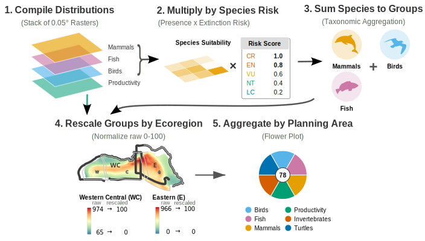

<!-- hero ----------------------------------------------------------------- -->
::::: {.hero}
:::: {.hero-content}

# Marine Sensitivity Toolkit

::: {.tagline}
Quantifying ecological sensitivity to offshore energy development across the U.S. continental shelf
:::

{.boem-logo}

::::
:::::

<!-- explore the data ----------------------------------------------------- -->
:::: {.section-container}
## Explore the Data

```{=html}
<div class="app-cards">
  <a class="app-card" href="https://app.marinesensitivity.org/mapgl/" target="_blank">
    <i class="bi bi-globe-americas"></i>
    <h3>Composite Scores</h3>
    <p>Interactive map of composite sensitivity scores across Program Areas</p>
  </a>
  <a class="app-card" href="https://app.marinesensitivity.org/mapsp/" target="_blank">
    <i class="bi bi-layers"></i>
    <h3>Species Distributions</h3>
    <p>Individual species distribution models, habitat suitability, and extinction risk</p>
  </a>
  <a class="app-card" href="https://marinesensitivity.org/docs/" target="_blank">
    <i class="bi bi-book"></i>
    <h3>Documentation</h3>
    <p>Technical methods, data sources, and workflow notebooks</p>
  </a>
</div>
```
::::


<!-- methodology ---------------------------------------------------------- -->
:::: {.section-container}
## Methodology Overview

The Marine Sensitivity Toolkit integrates species distribution models, extinction risk scores, and cumulative impact layers to produce composite sensitivity surfaces for offshore energy planning areas. The framework synthesizes data from NOAA, USFWS, IUCN, and academic sources to support evidence-based decision making under the Outer Continental Shelf Lands Act.

::: {.method-figure}
{.lightbox}
:::
::::

<!-- about ---------------------------------------------------------------- -->
::::: {.section-container}
## About

The Bureau of Ocean Energy Management (BOEM) is mandated under the **Outer Continental Shelf Lands Act** (OCSLA) to balance energy development with environmental protection. The Marine Sensitivity Toolkit provides spatially explicit, species-level sensitivity metrics to inform leasing decisions and environmental reviews across the National OCS Program.

:::: {.about-stats}

::: {.stat-item}
{.stat-icon}

[Fish & Invertebrates]{.stat-label}
:::

::: {.stat-item}
{.stat-icon}

[Marine Mammals]{.stat-label}
:::

::: {.stat-item}
{.stat-icon}

[Seabirds]{.stat-label}
:::

::: {.stat-item}
{.stat-icon}

[Ocean Productivity]{.stat-label}
:::

::::
:::::

<!-- version history ------------------------------------------------------ -->
::::: {.section-container}
## Version History

:::: {.timeline}

::: {.timeline-item .current}
### v3

[February 2026 – present]{.timeline-date}

Program Areas for the National OCS Plan. Ecoregion rescaling. Seven source datasets merged from continuous suitability models (AquaMaps) to binary range maps (NMFS, FWS, BirdLife, IUCN) with masking (where global IUCN range map exists). New species sensitivity weighting based on national ESA or global IUCN extinction risk along with protection from Marine Mammal Protection Act (MMPA) or Migratory Bird Treaty Act (MBTA).
:::

::: {.timeline-item}
### v2

[January 2026]{.timeline-date}

Transition to Program Areas (2026). Individual model layers. Model merging pipeline. Cloud-optimized GeoTIFF storage.
:::

::: {.timeline-item}
### v1

[September 2023 – December 2025]{.timeline-date}

Planning Areas across U.S. EEZ. AquaMaps-based species distributions. Flower plots for multi-taxa visualization. Species tables with conservation status.
:::

::::
:::::
