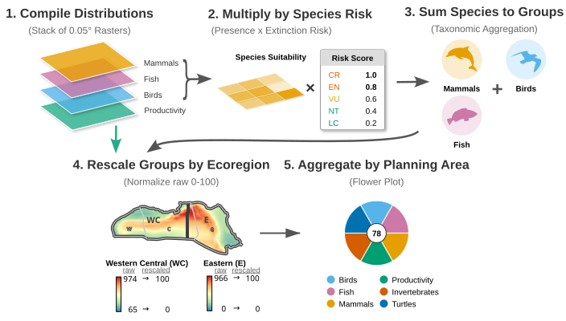

<!-- hero ----------------------------------------------------------------- -->
::::: {.hero}
:::: {.hero-content}

# Marine Sensitivity Toolkit

::: {.tagline}

**The Marine Sensitivity Toolkit**<br>
_atlas of species distributions and federal conservation status in support of U.S. offshore energy planning_

:::

{.boem-logo}

::::
:::::

<!-- explore the data ----------------------------------------------------- -->
:::: {.section-container}
## Explore the Data

```{=html}
<div class="app-cards">
  <a class="app-card" href="https://app.marinesensitivity.org/scores/" target="_blank">
    <i class="bi bi-globe-americas"></i>
    <h3>Composite Scores</h3>
    <p>Interactive map of composite sensitivity scores across Program Areas</p>
  </a>
  <a class="app-card" href="https://app.marinesensitivity.org/species/" target="_blank">
    <i class="bi bi-layers"></i>
    <h3>Species Distributions</h3>
    <p>Individual species distribution models, habitat suitability, and extinction risk</p>
  </a>
  <a class="app-card" href="https://marinesensitivity.org/docs/" target="_blank">
    <i class="bi bi-book"></i>
    <h3>Documentation</h3>
    <p>Technical methods, data sources, and workflow notebooks</p>
  </a>
</div>
```
::::


<!-- methodology ---------------------------------------------------------- -->
:::: {.section-container}
## Methodology Overview

The Marine Sensitivity Toolkit integrates species distribution models, extinction risk scores, and cumulative impact layers to produce composite sensitivity surfaces for offshore energy planning areas. The framework synthesizes data from NOAA, USFWS, IUCN, and academic sources to support evidence-based decision making under the Outer Continental Shelf Lands Act. For more, see the [Documentation](https://marinesensitivity.org/docs/).

::: {.method-figure}
{.lightbox}
:::
::::

<!-- about ---------------------------------------------------------------- -->
::::: {.section-container}
## About

The Bureau of Ocean Energy Management (BOEM) is mandated under the **Outer Continental Shelf Lands Act** (OCSLA) to balance energy development with environmental protection. The Marine Sensitivity Toolkit provides spatially explicit, species-level sensitivity metrics to inform leasing decisions and environmental reviews across the National OCS Program.

:::: {.about-stats}

::: {.stat-item}
{.stat-icon}

[Fish]{.stat-label}
:::

::: {.stat-item}
{.stat-icon}

[Marine Mammals]{.stat-label}
:::

::: {.stat-item}
{.stat-icon}

[Seabirds]{.stat-label}
:::

::: {.stat-item}
{.stat-icon}

[Primary Productivity]{.stat-label}
:::

::: {.stat-item}
<i class="bi bi-three-dots"></i>
[And more]{.stat-label}
:::

::::
:::::

<!-- version history ------------------------------------------------------ -->
::::: {.section-container}
## Version History

:::: {.timeline}

::: {.timeline-item .preview}
### v9 — AquaX + spatial extinction risk [PRE-RELEASE · REVIEWERS]{.badge-prerelease}

[Preview · August 2026 — under review; v7 remains the default]{.timeline-date}

Builds on the v8 Marine Atlas with two changes to *what* is scored, on the same global grid:

- **AquaX supersedes AquaMaps in US waters.** 10,536 ensemble habitat-suitability models from the AquaX framework (Reygondeau et al. 2026), delivered on the analysis grid and masked to US waters, replace AquaMaps for the same species wherever AquaX was modeled (10,517 species); AquaMaps continues for the ~6,000 species AquaX did not model and everywhere outside its mask. Each input can be viewed *as delivered* and *as ingested*.
- **Extinction risk is spatial for species listed by Distinct Population Segment.** For the 19 species whose ESA listing applies to some populations only (humpback and Southern Resident killer whales, Cook Inlet beluga, the salmon and steelhead ESUs, both sturgeons, …) risk is a per-cell surface — each listed entity's status inside its designated critical habitat, from NOAA Fisheries' authoritative service, and the species' baseline elsewhere — carried beside the merged model and applied at scoring. The humpback no longer reads Endangered species-wide from DPSs that breed outside US waters.
- **Program-Area scores stay equivalent** to v8 on common inputs (a control run with supersession off reproduces v8 exactly), and the 2,742 species AquaX modeled but found absent in US waters keep their AquaMaps surface pending review.

```{=html}
<div class="timeline-apps">
  <a href="https://preview.marinesensitivity.org/v9/scores/" target="_blank">Composite Scores (v9) →</a>
  <a href="https://preview.marinesensitivity.org/v9/species/" target="_blank">Species Distributions (v9) →</a>
  <a href="https://preview.marinesensitivity.org/docs/v9/" target="_blank">Documentation (v9) →</a>
</div>
```

Pre-releases are served from the **review host** and open only to invited reviewers (sign in with your reviewer e-mail; a one-time code is sent). The public apps always show the current release.
:::

::: {.timeline-item .preview}
### v8 — Marine Atlas [PRE-RELEASE · REVIEWERS]{.badge-prerelease}

[Preview · July–August 2026 — under review; v7 remains the default]{.timeline-date}

A ground-up rebuild as a global **Marine Atlas**. What differs from v7:

- **Whole-range global ingest.** Every species is modeled across its *entire* global range on a shared global 0.05° ocean grid — no US land mask, no Program-Area gate — so a species' full distribution is captured and "how marine" is a *derived* metric, not a filter.
- **Seabird de-duplication.** A BirdLife-sisid ↔ WoRMS-aphia crosswalk merges each bird's BirdLife, USFWS, and AquaMaps inputs into a *single* model; v7 split some seabirds across two taxa (e.g. Marbled Murrelet, Brown Pelican). This removes double-counting — seabird-heavy Program Areas (Alaska, Pacific) score several points lower than v7 as a result, with overall Program-Area correlation to v7 of 0.94.
- **Original *and* interpolated distributions.** Each source model is published in two representations — the native-resolution original (e.g. AquaMaps 0.5° HCAF) and the 0.05° interpolated surface used in scoring — stored in a **STAC** catalog and toggleable in the species app.
- **Partitioned-Parquet marine-atlas on S3.** All layers are released as content-addressed, partitioned Parquet served via titiler + a STAC catalog, replacing per-dataset archives.
- **Taxonomy-driven categories.** Species categories come from WoRMS taxonomy (no catch-all "other" bucket); reptiles and amphibians are excluded from scoring.

```{=html}
<div class="timeline-apps">
  <a href="https://preview.marinesensitivity.org/v8/scores/" target="_blank">Composite Scores (v8) →</a>
  <a href="https://preview.marinesensitivity.org/v8/species/" target="_blank">Species Distributions (v8) →</a>
  <a href="https://preview.marinesensitivity.org/docs/v8/" target="_blank">Documentation (v8) →</a>
</div>
```
:::

::: {.timeline-item .current}
### v7

[June 2026 – present]{.timeline-date}

Decoupled species validity from Program Area overlap. Earlier versions silently required a species to overlap a current BOEM Program Area to count as valid, which hid biodiversity outside the program cycle's footprint. Validity now means a taxonomically valid species with a modeled distribution anywhere in the study area, restoring the full set from 9,424 to **16,153 valid marine species** — of which **9,230** fall within the 20 BOEM Program Areas. Program Area membership is now applied as a spatial query rather than a species-level filter, so the map and report applications show marine life everywhere in US waters, not only within Program Areas. Scores were recomputed over the full set with negligible effect on Program Area scores (18 of 20 unchanged; only Gulf of America GAB −0.04 and GAA −0.00 shifted).
:::

::: {.timeline-item}
### v6

[March 2026 – June 2026]{.timeline-date}

Excluded 371 species (343 fish, 20 invertebrates, 6 corals, 2 mammals) whose IUCN expert range maps fall entirely outside the US EEZ — their AquaMaps predictions in US waters were edge-of-range model artifacts with near-zero suitability, now removed. Ingested 3 missing mammal IUCN range maps (*Phoca vitulina*, *Trichechus manatus*, *Pusa hispida*) from more complete IUCN mammals download. Net effect on Program Area scores is negligible: Southern California (SOC) Score +1, coral +3, fish -1.
:::

::: {.timeline-item}
### v5

[March 2026]{.timeline-date}

Fixed MMPA spatial floor (minimum 20) for FWS-managed marine mammals (walrus, polar bear, sea otter, manatee, dugong) that were missing MMPA protection in earlier versions. Documented the bifurcation of modeling approaches: standard species use a scalar extinction risk weight at scoring time, while sea turtles use a spatially varying extinction risk raster (from SWOT+DPS) multiplied during model merging.
:::

::: {.timeline-item}
### v4

[March 2026]{.timeline-date}

Replaced overly extensive IUCN sea turtle range maps with more realistic State of the World's Turtles (SWOT) global distributions (viewable at [seamap.env.duke.edu/swot](http://seamap.env.duke.edu/swot)). Applied NOAA Distinct Population Segment (DPS) polygons with ESA listing status (NMFS:EN 100, NMFS:TN 50) to differentiate Endangered vs Threatened populations, resulting in more restrictive distributions dominated by ESA risk values. (See workflow [ingest\_turtles-swot-dps](https://marinesensitivity.org/workflows/ingest_turtles-swot-dps.html).)
:::

::: {.timeline-item}
### v3

[February 2026]{.timeline-date}

Program Areas for the National OCS Plan. Ecoregion rescaling. Seven source datasets merged from continuous suitability models (AquaMaps) to binary range maps (NMFS, FWS, BirdLife, IUCN) with masking (where global IUCN range map exists). New species sensitivity weighting based on national ESA or global IUCN extinction risk along with protection from Marine Mammal Protection Act (MMPA) and Migratory Bird Treaty Act (MBTA).
:::

::: {.timeline-item}
### v2

[January 2026]{.timeline-date}

Transition to Program Areas (2026). Individual model layers. Model merging pipeline. Cloud-optimized GeoTIFF storage.
:::

::: {.timeline-item}
### v1

[September 2023 – December 2025]{.timeline-date}

Planning Areas across U.S. EEZ. AquaMaps-based species distributions. Flower plots for multi-taxa visualization. Species tables with conservation status.
:::

::::
:::::
